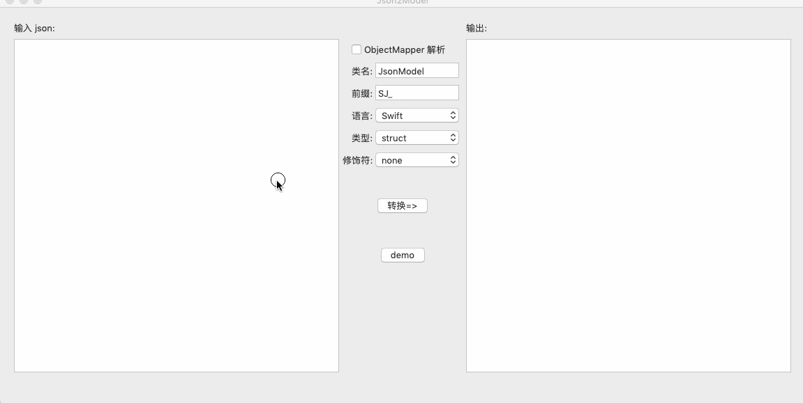

# json2swift

根据json字符串自动生成swift对应的类代码。




> 说明

基于python2实现的json转model


## 使用方式

-  [json2Swift.app](https://pan.baidu.com/s/1skW4Jxj)

  在输入框中输入json字符串
  配置相关参数(是否由objectMapper解析，外部类名, 前缀 )
  点击『转换=>』, 结果会在右侧输出

- [python 脚本](./script)

  定位到Main.py文件，将json字符串拷贝至"jsons.txt"
  终端执行```python3 Main.py```
  结果保存在该目录下的"ResultMode.swift"文件中

  

***

## 其他
[CocoaPython](./json2Swift/CocoaPython.swift): 封装后的Process，便于直接调用python脚本
使用如下:
```swift
// python脚本文件路径
guard let aPath = Bundle.main.path(forResource: "Parse", ofType: "py") else { return }

// args: py文件接受的参数列表，通过sys.argv[i]访问
// block: 完成后的回调，包括返回值和错误内容
let script = CocoaPython(scrPath: aPath, args: [""]) { [weak self] in
    print($0) // 返回值，所有的py中print()的内容
    print($1) // py中的错误信息
}

script.spliPara = "$" // 如果有多个结果，每个结果之间的分隔符，不设置则将所有的结果当成一个结果返回，即result == result[0]
script.runAsync() // 异步执行，回调在异步主线程中调用
// or script.runAsync(asyncComlete: false) // 异步执行，回调在global中执行
// or script.runSync() // 同步执行
```

***
## 参考

- python 简单入门指北
- [Python教程](https://www.liaoxuefeng.com/wiki/0014316089557264a6b348958f449949df42a6d3a2e542c000)
- [Running a Python Script from Swift](http://martinhoeller.net/running-a-python-script-from-swift/)

